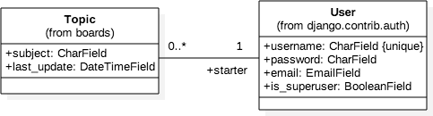

# Django Web Board Project

[](https://python.org)
[](https://djangoproject.com)


Figure 1: Use case diagram of the core functionalities offered by the Web Board


Figure 2: Draft of the class diagram of the Web Board


Figure 3: Class diagram emphasizing the relationship between the classes (models)


##  Relationship between the models:





## Another way to draw this class diagram is emphasizing the fields rather than in the relationship between the models:


##  Wireframes


Figure 5: Boards project wireframe homepage listing all the available boards.


Figure 6: Boards project wireframe listing all topics in the Django board.


Figure 7: New topic screen


Figure 8: Topic posts listing screen


Figure 9: Reply topic screen


## Comparison between the class diagram and the source code to generate the models with Django


## Running the Project Locally

First, clone the repository to your local machine:

```bash
https://github.com/theprogrammingthinker/Django-Web-Board-Project.git
```

Install the requirements:

```bash
pip install -r requirements.txt
```

Setup the local configurations:

```bash
cp .env.example .env
```

Create the database:

```bash
python manage.py migrate
```

Finally, run the development server:

```bash
python manage.py runserver
```

The project will be available at **127.0.0.1:8000**.
